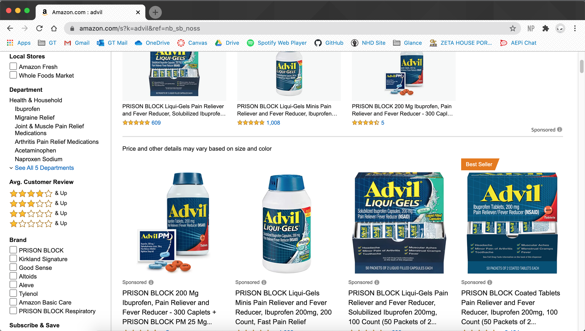
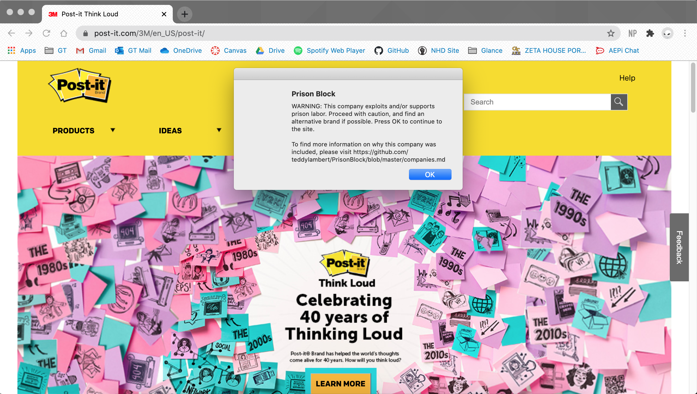

# Prison Block
A web browser extension to notify users of companies that use and/or support prison labor and the prison-industrial complex.

If you have any other companies that you know use prison labor and want added to the list, feel free to contact me at tclambert00@gmail.com or, if you know git, create a pull request and add the company to the `companies.md` file so we can review the addition! Before submitting a company, please read the 'Submitting Companies' section below.

We are currently working on adding the extension to the Chrome Web Store so future updates are easier to install.

Thanks!

## v1.0
Any companies that use prison labor have their name changed to "PRISON BLOCK" any time it appears on a webpage.

## v2.0
A pop-up will appear any time you try to access the website of a company that uses prison labor. After closing, the pop-up will sleep for 1 hour before appearing on that website again.

# Installation Instructions
1. Go to https://github.com/teddylambert/PrisonBlock/
2. Click on the green "Code" button
3. Press "Download ZIP"
2. Open Chrome and go to **Window** -> **Extensions**
3. Click on the slide switch in the top right corner to turn on developer mode
4. A button that says "Load unpacked" should appear. Click that button, and navigate to where you stored the unzipped folder for the extension
5. Click on the folder and press select. The extension should now be added to chrome!
6. You can now turn off developer mode and continue to use Chrome as normal

# Submitting Companies
If you know of a company that uses prison labor that we did not include on this list let us know! However, if you are going to submit a company, we ask that you *please include a recent source (< 1 year) that helps verify your claim*. Companies without sources will not be added at this time, as we want to make sure the companies on this list actually belong here. Much of what we have found online/on social media references articles from 5+ years ago, during which times the companies have changed their practices. This extension is meant only for companies *_currently_* benefitting from prison labor, as these are the companies that should be avoided and whose practices are most in need of change. Thank you!

# Known Bugs
1. Replacing text function does not work on some websites (Target, Walmart, etc). I am not fluent enough in Javascript and web development to know why at this time
2. Some false positives exist with companies with common words as their brand name (Command). Brute forcing conditionals to get rid of these rare occurances seemed too tedious to implement.

# Acknowledgements
The idea and initial company list are all thanks to Ella Lambert. I only dealt with helping turn the idea into an implementable reality.

The v1.0 implementation follows laurenorsini [Caaaaarbs](https://github.com/laurenorsini/caaaaarbs) and Steven Frank's [Cloud to Butt](https://github.com/panicsteve/cloud-to-butt). Thanks for the inspiration! 
